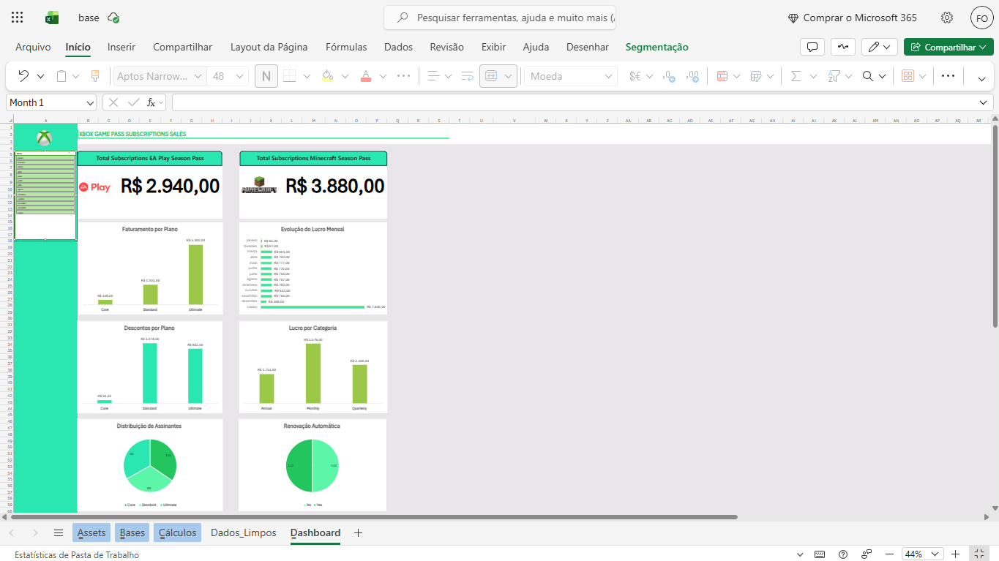

# Dashboard Xbox Game Pass - Análise de Vendas e Lucro

---

## 🎓 Formação e Contexto
Este projeto foi desenvolvido como parte do **Bootcamp Klabin - Excel e Power BI Dashboards 2026**, oferecido pela [DIO](https://www.dio.me/) em parceria com a [Klabin](https://www.klabin.com.br/). A participação neste programa é viabilizada por uma bolsa de estudos focada em capacitação tecnológica e análise de dados.

## 📌 Sobre o Projeto
Este projeto apresenta um dashboard interativo focado nos indicadores de desempenho (KPIs) do serviço Xbox Game Pass. O objetivo foi transformar dados brutos em insights visuais sobre faturamento, planos mais vendidos e lucro mensal.

---

## 📂 Download do Projeto
Para visualizar o dashboard completo com todas as fórmulas, tabelas dinâmicas e a estrutura de dados, você pode acessar o arquivo diretamente pelo link abaixo:

* **[📥 Baixar o Dashboard (Excel .xlsx)](./dashboard-xbox-gamepass.xlsx)**

---

## 🚀 Desafios e Superação Técnica (Excel Web vs. Desktop)
Diferente da abordagem padrão em ambiente Desktop, este projeto foi desenvolvido inteiramente utilizando ferramentas **Cloud/Web (Excel Web e Google Colab)**. 

### Por que o uso de ferramentas Web?
* **Limitação de Hardware:** O projeto foi realizado em um computador local emprestado, sem o pacote Office instalado e com capacidade limitada para softwares pesados.
* **Solução:** Para contornar a falta do Excel Desktop, utilizei o **Excel Web** para a visualização e o **Google Colab (Python)** para o processamento pesado de dados.

### Manobras Técnicas Realizadas:
1. **ETL com Python (Google Colab):** - A base original possuía apenas ~99 linhas e focava apenas no plano *Ultimate*.
   - Utilizei scripts em Python para limpar IDs desordenados e expandir a base para **297 linhas**.
   - Incrementei a diversidade dos dados adicionando os planos *Standard* e *Core*, tornando a análise mais realista.
   
2. **Design Adaptativo no Excel Web:**
   - Devido às limitações do Excel Web em lidar com objetos flutuantes e conexões de segmentação de dados, tive que criar o Dashboard utilizando o **redimensionamento de células** e vínculos diretos de fórmulas para simular "cartões" (Big Numbers), garantindo que o painel permanecesse operacional e dinâmico.
   - O processo exigiu manobras em células para garantir que a atualização das tabelas dinâmicas refletisse corretamente nos gráficos.
  
3. **Enriquecimento de Variáveis e Lógica de Negócio:**
   - **Problema Detectado:** A base original era estática; tanto o *EA Play* quanto o *Minecraft Season Pass* estavam marcados como "Sim" em 100% das linhas, com valores fixos de R$ 30,00 e R$ 20,00, respectivamente.
   - **Solução via Python:** Diversifiquei os dados no script de ETL, criando cenários de "Sim" e "Não" para ambos os serviços e variando os preços proporcionalmente aos planos (*Core, Standard, Ultimate*).
   - **Resultado:** Essa manobra transformou dados repetitivos em métricas dinâmicas, permitindo visualizar a real penetração desses serviços e seu impacto proporcional no lucro total do Dashboard.

---

## 📊 Funcionalidades
- **Segmentação de Dados:** Filtros interativos por mês que atualizam todos os gráficos simultaneamente.
- **KPIs Principais:** Visualização de Lucro Total por plano (Minecraft e EA Play).
- **Gráficos Dinâmicos:** Comparativos de faturamento e distribuição de assinaturas.

---

## 🛠️ Tecnologias Utilizadas
- **Excel Web:** Construção do Dashboard e Tabelas Dinâmicas.
- **Python (Pandas):** Tratamento, limpeza e expansão da base de dados (ETL).
- **Google Colab:** Ambiente de execução do script Python.

* [Excel Web](https://www.microsoft.com/pt-br/microsoft-365/free-office-online-for-the-web) - Construção do Dashboard e Tabelas Dinâmicas.
* [Python (Pandas)](https://pandas.pydata.org/) - Tratamento, limpeza e expansão da base de dados (ETL).
* [Google Colab](https://colab.research.google.com/) - Ambiente de execução do script Python.
* **[Script de Tratamento de Dados](./Data_Flow_Excel_Project.ipynb)** - Link direto para o código Python utilizado neste projeto.
---

## 📝 Conclusão
Este projeto demonstra que a falta de ferramentas robustas locais não é um impedimento para a entrega de análises de dados de alta qualidade. A integração entre Python e Excel Web permitiu superar barreiras técnicas e entregar um produto final funcional, estético e preciso.
